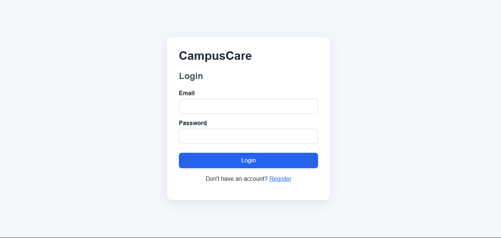
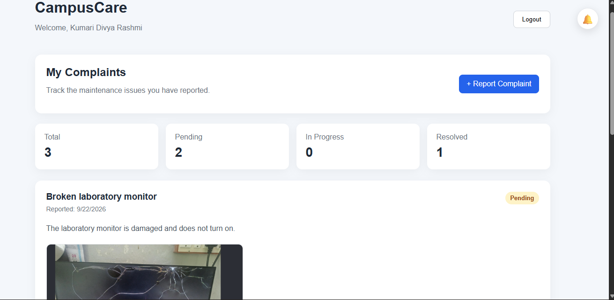
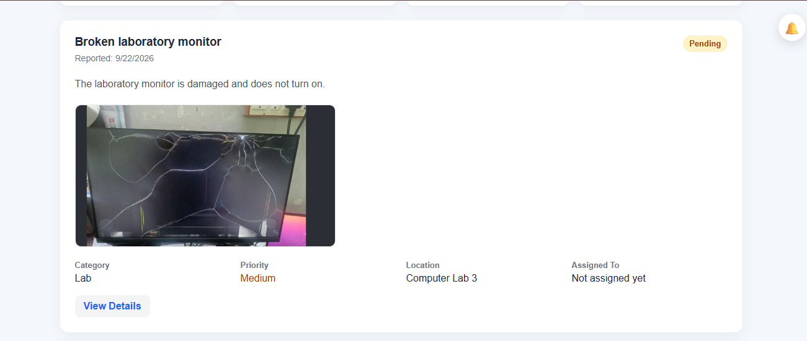
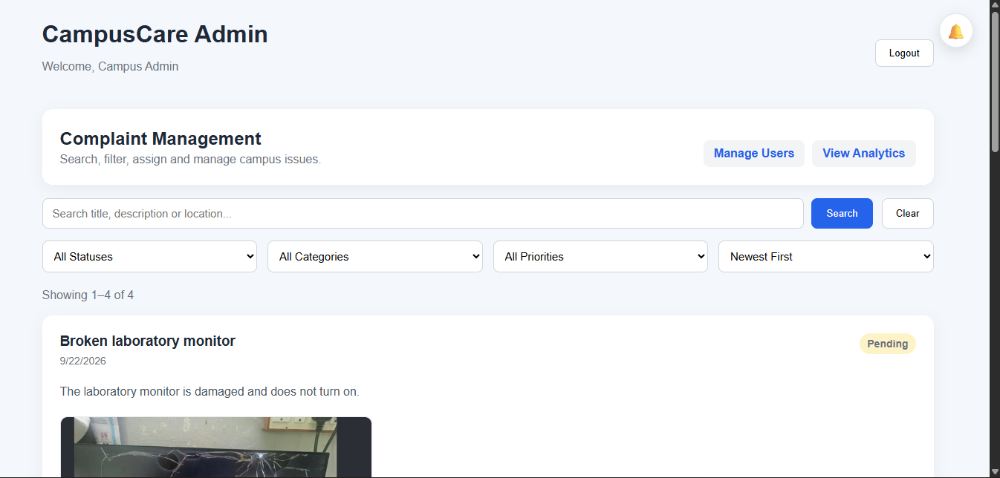
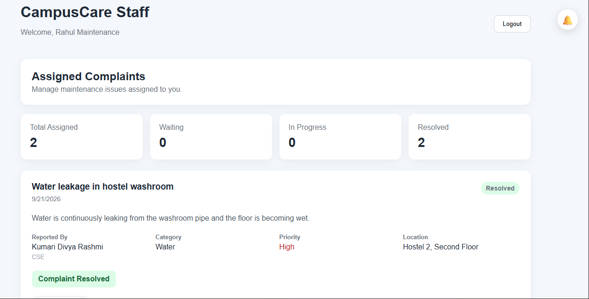
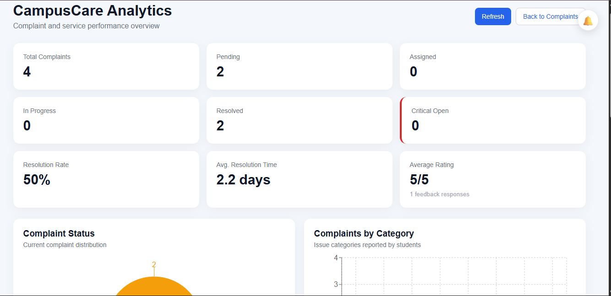
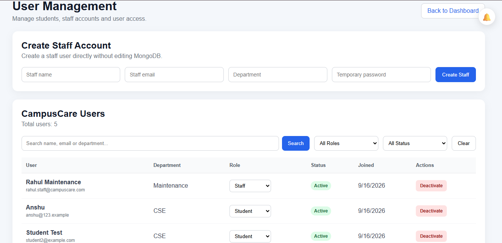

# 🏫 CampusCare — College Complaint & Maintenance Management System

CampusCare is a full-stack MERN application designed to manage college complaints and maintenance requests through a structured workflow.

Students can report campus issues, administrators can review and assign complaints to staff members, and staff can update the progress until the issue is resolved.

The application also includes image evidence uploads, comments, activity history, student feedback, analytics, persistent notifications, real-time Socket.IO notifications, user management, role-based authorization, automated testing, and production-ready security features.

---

## 📌 Table of Contents

- [Project Overview](#-project-overview)
- [Problem Statement](#-problem-statement)
- [Solution](#-solution)
- [User Roles](#-user-roles)
- [Main Features](#-main-features)
- [Complaint Workflow](#-complaint-workflow)
- [Technology Stack](#-technology-stack)
- [Project Architecture](#-project-architecture)
- [Project Structure](#-project-structure)
- [Backend API](#-backend-api)
- [Database Models](#-database-models)
- [Environment Variables](#-environment-variables)
- [Local Setup](#-local-setup)
- [Testing](#-testing)
- [Security Features](#-security-features)
- [Real-Time Notifications](#-real-time-notifications)
- [Analytics](#-analytics)
- [Deployment](#-deployment)
- [Screenshots](#-screenshots)
- [Future Improvements](#-future-improvements)
- [Author](#-author)

---

# 📖 Project Overview

CampusCare is a **College Complaint & Maintenance Management System** that provides a centralized platform for reporting, assigning, tracking, and resolving campus-related issues.

Instead of students reporting problems manually to different departments, CampusCare provides one system where complaints can move through a clear workflow:

```text
Student reports issue
        ↓
Admin reviews complaint
        ↓
Admin assigns Staff
        ↓
Staff starts work
        ↓
Staff resolves issue
        ↓
Student receives notification
        ↓
Student provides feedback
```

The system supports three user roles:

- Student
- Staff
- Admin

Each role has different permissions and dashboards.

---

# ❓ Problem Statement

In colleges, maintenance-related issues such as:

- Wi-Fi problems
- Electrical faults
- Water supply issues
- Hostel maintenance
- Classroom equipment failures
- Computer laboratory issues
- Cleanliness problems

are often reported manually.

This creates several problems:

- No centralized complaint tracking
- Difficulty identifying who is responsible for an issue
- Students cannot easily track complaint progress
- Administrators cannot analyze maintenance performance
- Staff may not receive updates immediately
- There is little accountability or history of complaint actions
- Student satisfaction is difficult to measure

---

# 💡 Solution

CampusCare solves these problems using a centralized web application.

Students can submit complaints with detailed information and optional image evidence.

Administrators can:

- monitor complaints,
- search and filter issues,
- assign staff members,
- manage users,
- and analyze complaint performance.

Staff members can:

- view assigned complaints,
- start work,
- resolve complaints,
- communicate through comments,
- and receive real-time assignment notifications.

Students can track every stage of their complaint and provide feedback after resolution.

---

# 👥 User Roles

## 🎓 Student

Students can:

- Register and login
- Create complaints
- Select complaint category
- Select priority
- Add location
- Upload image evidence
- View their complaints
- Track complaint status
- View assigned staff
- View complaint details
- Add comments
- View complaint activity history
- Receive real-time notifications
- Give a 1–5 star rating after resolution
- Submit feedback

---

## 🛠️ Staff

Staff members can:

- Login to the Staff Dashboard
- View only complaints assigned to them
- View complaint evidence
- View student details
- Add comments
- View activity history
- Change complaint status

Supported workflow:

```text
Assigned
   ↓
In Progress
   ↓
Resolved
```

Staff also receive real-time notifications when new complaints are assigned.

---

## 👨‍💼 Admin

Administrators can:

- View all complaints
- Search complaints
- Filter complaints
- Sort complaints
- Use pagination
- Assign complaints to staff
- View complaint details
- View evidence images
- Add comments
- View activity history
- View student feedback
- Access analytics
- Create Staff accounts
- Promote Student → Staff
- Change Staff → Student
- Activate users
- Deactivate users
- Search users
- Filter users by role and status

---

# ✨ Main Features

## 🔐 Authentication

CampusCare provides JWT-based authentication.

Features include:

- Student registration
- User login
- Password hashing using bcrypt
- JWT authentication
- Protected backend routes
- Protected frontend routes
- Role-based authorization
- Active/inactive user checking

---

## 🛡️ Role-Based Access Control

The application supports:

```text
student
staff
admin
```

Protected routes ensure users can access only permitted functionality.

Example:

```text
Student → /student
Staff   → /staff
Admin   → /admin
```

---

## 📝 Complaint Management

A complaint contains:

- Title
- Description
- Category
- Priority
- Status
- Location
- Student
- Assigned Staff
- Evidence image
- Created time
- Resolved time

Supported categories:

```text
Wi-Fi
Electricity
Water
Hostel
Classroom
Lab
Cleanliness
Other
```

Supported priorities:

```text
Low
Medium
High
Critical
```

---

## 📷 Image Evidence Upload

Students can attach evidence while creating a complaint.

Supported formats:

```text
JPG
PNG
WEBP
```

Maximum image size:

```text
5 MB
```

Images are uploaded to:

**Cloudinary**

MongoDB stores:

```text
Image URL
Cloudinary Public ID
```

Evidence can be viewed by:

- Student
- Admin
- Assigned Staff

---

## 🔎 Search, Filtering & Pagination

Admin complaint management supports:

### Search

Search using:

- Title
- Description
- Location

### Filters

Filter by:

- Status
- Category
- Priority

### Sorting

```text
Newest First
Oldest First
```

### Pagination

Complaints are fetched page-by-page from the backend instead of loading the complete database at once.

---

## 💬 Comments

Students, Admins, and assigned Staff can communicate using complaint comments.

Each comment stores:

- Complaint
- Author
- Message
- Date and time

---

## 🕒 Activity History

Important complaint actions are recorded automatically.

Examples:

```text
Complaint created
Admin assigned Rahul
Student added a comment
Staff added a comment
Status changed from assigned to in-progress
Status changed from in-progress to resolved
Student submitted feedback
```

This creates a simple audit trail for each complaint.

---

## ⭐ Student Feedback

After a complaint becomes:

```text
Resolved
```

the Student can submit:

```text
1–5 Star Rating
Optional Feedback Comment
```

Rules:

- Only the complaint owner can submit feedback.
- Complaint must be resolved.
- Only one feedback entry is allowed per complaint.

Admin can view feedback from the complaint detail page.

---

## 🔔 Persistent Notifications

Notifications are stored in MongoDB.

Examples:

### Student

```text
Complaint assigned
Work started
Complaint resolved
```

### Staff

```text
New complaint assigned
```

Notifications support:

- Read/unread status
- Unread count
- Mark one as read
- Mark all as read
- Opening the related complaint

---

## ⚡ Real-Time Notifications

CampusCare uses **Socket.IO** to deliver notifications instantly.

Example:

```text
Admin assigns Staff
        ↓
Notification saved in MongoDB
        ↓
Socket.IO emits event
        ↓
Staff notification bell updates immediately
```

Users are connected to private Socket.IO rooms:

```text
user:<USER_ID>
```

This prevents notifications from being broadcast to unrelated users.

Database-backed notifications also ensure messages remain available after refresh or logout/login.

---

## 👨‍💼 Admin User Management

Admin can manage CampusCare users without editing MongoDB manually.

Features include:

- View users
- Search users
- Filter by role
- Filter by status
- Create Staff accounts
- Promote Students to Staff
- Change Staff to Students
- Activate accounts
- Deactivate accounts

Deactivated accounts cannot:

- Login
- Access protected APIs
- Maintain authenticated Socket.IO connections

Inactive Staff members cannot receive new complaint assignments.

---

# 🔄 Complaint Workflow

The primary complaint lifecycle is:

```text
PENDING
   ↓
ASSIGNED
   ↓
IN-PROGRESS
   ↓
RESOLVED
```

### Step 1

Student creates complaint.

```text
status = pending
```

### Step 2

Admin assigns a Staff member.

```text
status = assigned
```

Student and Staff receive notifications.

### Step 3

Staff starts work.

```text
status = in-progress
```

Student receives a real-time notification.

### Step 4

Staff resolves complaint.

```text
status = resolved
resolvedAt = current time
```

Student receives a real-time notification.

### Step 5

Student submits feedback.

```text
rating = 1–5
feedback = optional text
```

---

# 🧰 Technology Stack

## Frontend

- React
- Vite
- React Router
- JavaScript
- CSS
- Fetch API
- Socket.IO Client
- Recharts

---

## Backend

- Node.js
- Express.js
- JavaScript
- Mongoose
- JWT
- bcryptjs
- Multer
- Socket.IO

---

## Database

- MongoDB
- MongoDB Atlas

---

## Cloud Storage

- Cloudinary

---

## Security

- Helmet
- Express Rate Limit
- HPP
- CORS
- JWT
- bcryptjs
- Request-size limits

---

## Testing

### Backend

- Vitest
- Supertest
- MongoDB Memory Server

### Frontend

- Vitest
- React Testing Library
- Jest DOM
- jsdom

---

## DevOps / Deployment

- Git
- GitHub
- GitHub Actions
- Render
- Vercel

---

# 🏗️ Project Architecture

```text
                   ┌──────────────────┐
                   │   React Client   │
                   │      Vite        │
                   └────────┬─────────┘
                            │
                            │ HTTP / Fetch
                            │ Socket.IO
                            ▼
                   ┌──────────────────┐
                   │ Express Backend  │
                   │     Node.js      │
                   └───────┬──────────┘
                           │
          ┌────────────────┼─────────────────┐
          │                │                 │
          ▼                ▼                 ▼
  ┌──────────────┐  ┌──────────────┐  ┌─────────────┐
  │ MongoDB Atlas│  │  Cloudinary  │  │ Socket.IO   │
  │              │  │              │  │ Real-Time   │
  └──────────────┘  └──────────────┘  └─────────────┘
```

---

# 📁 Project Structure

```text
CampusCare/
│
├── .github/
│   └── workflows/
│       └── ci.yml
│
├── client/
│   │
│   ├── src/
│   │   ├── components/
│   │   │   ├── AdminComplaintCard.jsx
│   │   │   ├── ComplaintCard.jsx
│   │   │   ├── NotificationBell.jsx
│   │   │   ├── NotificationBell.css
│   │   │   ├── ProtectedRoute.jsx
│   │   │   └── StaffComplaintCard.jsx
│   │   │
│   │   ├── config/
│   │   │   └── api.js
│   │   │
│   │   ├── context/
│   │   │   └── AuthContext.jsx
│   │   │
│   │   ├── pages/
│   │   │   ├── AdminAnalyticsPage.jsx
│   │   │   ├── AdminAnalyticsPage.css
│   │   │   ├── AdminDashboard.jsx
│   │   │   ├── AdminUsersPage.jsx
│   │   │   ├── AdminUsersPage.css
│   │   │   ├── ComplaintDetailsPage.jsx
│   │   │   ├── CreateComplaintPage.jsx
│   │   │   ├── LoginPage.jsx
│   │   │   ├── RegisterPage.jsx
│   │   │   ├── StaffDashboard.jsx
│   │   │   ├── StudentDashboard.jsx
│   │   │   └── UnauthorizedPage.jsx
│   │   │
│   │   ├── services/
│   │   │   ├── adminAnalyticsService.js
│   │   │   ├── adminService.js
│   │   │   ├── adminUserService.js
│   │   │   ├── complaintDetailsService.js
│   │   │   ├── complaintService.js
│   │   │   ├── notificationService.js
│   │   │   ├── socketService.js
│   │   │   └── staffService.js
│   │   │
│   │   ├── test/
│   │   ├── utils/
│   │   ├── App.jsx
│   │   └── App.css
│   │
│   ├── .env.example
│   ├── vercel.json
│   ├── vitest.config.js
│   └── package.json
│
├── server/
│   │
│   ├── src/
│   │   ├── config/
│   │   │   ├── cloudinary.js
│   │   │   ├── cors.js
│   │   │   ├── db.js
│   │   │   └── env.js
│   │   │
│   │   ├── controllers/
│   │   │   ├── adminController.js
│   │   │   ├── adminUserController.js
│   │   │   ├── analyticsController.js
│   │   │   ├── authController.js
│   │   │   ├── complaintController.js
│   │   │   ├── complaintInteractionController.js
│   │   │   ├── feedbackController.js
│   │   │   ├── notificationController.js
│   │   │   └── staffController.js
│   │   │
│   │   ├── middleware/
│   │   │   ├── authMiddleware.js
│   │   │   ├── errorMiddleware.js
│   │   │   ├── rateLimitMiddleware.js
│   │   │   └── uploadMiddleware.js
│   │   │
│   │   ├── models/
│   │   │   ├── Activity.js
│   │   │   ├── Comment.js
│   │   │   ├── Complaint.js
│   │   │   ├── Feedback.js
│   │   │   ├── Notification.js
│   │   │   └── User.js
│   │   │
│   │   ├── routes/
│   │   │   ├── adminRoutes.js
│   │   │   ├── authRoutes.js
│   │   │   ├── complaintRoutes.js
│   │   │   ├── notificationRoutes.js
│   │   │   └── staffRoutes.js
│   │   │
│   │   ├── scripts/
│   │   ├── socket/
│   │   │   └── socket.js
│   │   │
│   │   ├── utils/
│   │   │   ├── canAccessComplaint.js
│   │   │   ├── createNotification.js
│   │   │   ├── generateToken.js
│   │   │   ├── recordActivity.js
│   │   │   └── uploadToCloudinary.js
│   │   │
│   │   ├── app.js
│   │   └── server.js
│   │
│   ├── tests/
│   ├── .env.example
│   ├── vitest.config.js
│   └── package.json
│
├── .gitignore
└── README.md
```

---

# 🔌 Backend API

Base local URL:

```text
http://localhost:5000/api
```

---

## Authentication

### Register

```http
POST /api/auth/register
```

### Login

```http
POST /api/auth/login
```

### Current User

```http
GET /api/auth/me
```

---

## Student Complaints

### Create Complaint

```http
POST /api/complaints
```

Supports:

```text
multipart/form-data
```

Image field:

```text
image
```

### Get Student's Complaints

```http
GET /api/complaints/my
```

### Complaint Details

```http
GET /api/complaints/:complaintId/details
```

### Add Comment

```http
POST /api/complaints/:complaintId/comments
```

### Submit Feedback

```http
POST /api/complaints/:complaintId/feedback
```

---

## Staff

### Assigned Complaints

```http
GET /api/staff/complaints
```

### Update Status

```http
PATCH /api/staff/complaints/:complaintId/status
```

Valid flow:

```text
assigned
→ in-progress
→ resolved
```

---

## Admin Complaint Management

### Get Complaints

```http
GET /api/admin/complaints
```

Supports query parameters:

```text
search
status
category
priority
sort
page
limit
```

Example:

```text
/api/admin/complaints?status=pending&category=wifi&page=1&limit=6
```

### Get Staff

```http
GET /api/admin/staff
```

### Assign Complaint

```http
PATCH /api/admin/complaints/:complaintId/assign
```

---

## Admin Analytics

```http
GET /api/admin/analytics
```

---

## Admin User Management

### Get Users

```http
GET /api/admin/users
```

### Create Staff

```http
POST /api/admin/users/staff
```

### Update User Status

```http
PATCH /api/admin/users/:userId/status
```

### Update User Role

```http
PATCH /api/admin/users/:userId/role
```

---

## Notifications

### Get Notifications

```http
GET /api/notifications
```

### Mark Notification Read

```http
PATCH /api/notifications/:notificationId/read
```

### Mark All Notifications Read

```http
PATCH /api/notifications/read-all
```

---

## Health Check

```http
GET /api/health
```

Example response:

```json
{
  "success": true,
  "message": "CampusCare backend is healthy",
  "database": "connected"
}
```

---

# 🗄️ Database Models

CampusCare currently uses these main MongoDB collections:

```text
users
complaints
comments
activities
feedbacks
notifications
```

---

## User

Important fields:

```text
name
email
password
role
department
isActive
```

---

## Complaint

Important fields:

```text
title
description
category
priority
status
location
createdBy
assignedTo
evidenceImage
resolvedAt
createdAt
updatedAt
```

---

## Comment

```text
complaint
author
message
createdAt
```

---

## Activity

```text
complaint
actor
action
message
createdAt
```

---

## Feedback

```text
complaint
student
rating
comment
createdAt
```

---

## Notification

```text
recipient
type
title
message
complaint
isRead
readAt
createdAt
```

---

# 🔐 Environment Variables

## Backend

Create:

```text
server/.env
```

Example:

```env
NODE_ENV=development

PORT=5000

MONGO_URI=your_mongodb_connection_string

JWT_SECRET=your_long_random_secret
JWT_EXPIRES_IN=7d

CLIENT_URL=http://localhost:5173
CORS_ORIGINS=http://localhost:5173

CLOUDINARY_CLOUD_NAME=your_cloudinary_cloud_name
CLOUDINARY_API_KEY=your_cloudinary_api_key
CLOUDINARY_API_SECRET=your_cloudinary_api_secret

RATE_LIMIT_WINDOW_MS=900000
RATE_LIMIT_MAX=300
AUTH_RATE_LIMIT_MAX=20
```

Never commit the real `.env` file.

---

## Frontend

Create:

```text
client/.env
```

Example:

```env
VITE_API_URL=http://localhost:5000/api
```

For production:

```env
VITE_API_URL=https://your-backend-domain.com/api
```

---

# 💻 Local Setup

## 1. Clone Repository

```bash
git clone https://github.com/YOUR_USERNAME/YOUR_REPOSITORY.git
```

Move into project:

```bash
cd CampusCare
```

---

## 2. Install Backend Dependencies

```bash
cd server
npm install
```

Create:

```text
server/.env
```

using:

```text
server/.env.example
```

as reference.

Run backend:

```bash
npm run dev
```

Backend:

```text
http://localhost:5000
```

Health endpoint:

```text
http://localhost:5000/api/health
```

---

## 3. Install Frontend Dependencies

Open another terminal:

```bash
cd client
npm install
```

Create:

```text
client/.env
```

with:

```env
VITE_API_URL=http://localhost:5000/api
```

Run frontend:

```bash
npm run dev
```

Frontend:

```text
http://localhost:5173
```

---

# 🧪 Testing

CampusCare includes automated backend and frontend tests.

---

## Backend Tests

Move to:

```bash
cd server
```

Run:

```bash
npm test
```

Backend testing covers important workflows including:

- Registration
- Login
- JWT authentication
- Deactivated accounts
- Student complaint creation
- Admin assignment
- Staff workflow
- Complaint resolution
- Comments
- Feedback
- Duplicate feedback prevention
- Notifications
- Analytics
- Admin user management
- RBAC

Tests use:

```text
Vitest
Supertest
MongoDB Memory Server
```

The automated tests do not require the real MongoDB Atlas database.

---

## Frontend Tests

Move to:

```bash
cd client
```

Run:

```bash
npm test
```

Frontend tests cover:

- Protected routes
- Unauthorized redirects
- Role-based routing
- Dashboard path selection
- Student → Admin → Staff API workflow

---

## Production Build Test

```bash
npm run build
```

---

# 🔄 Continuous Integration

CampusCare uses:

```text
GitHub Actions
```

Workflow:

```text
.github/workflows/ci.yml
```

For supported pushes and pull requests, CI performs:

```text
Backend
├── Install dependencies
└── Run tests

Frontend
├── Install dependencies
├── Run tests
└── Build application
```

This helps detect problems before deployment.

---

# 🛡️ Security Features

The backend includes several production-oriented security measures.

### Password Security

Passwords are hashed using:

```text
bcryptjs
```

Plain-text passwords are not stored.

---

### JWT Authentication

Protected requests require:

```text
Authorization: Bearer <JWT>
```

Tokens include:

```text
Issuer verification
Audience verification
Expiration
```

---

### Authorization

Backend routes verify:

```text
Student
Staff
Admin
```

permissions independently of the frontend.

---

### Security Headers

```text
Helmet
```

adds important HTTP security headers.

---

### API Rate Limiting

General APIs and authentication routes have rate limits.

This helps reduce:

- brute-force login attempts,
- API abuse,
- excessive automated requests.

---

### CORS

Only configured frontend origins can access the backend from browsers.

---

### Request Size Limits

JSON request bodies are restricted.

Image uploads also have a:

```text
5 MB
```

limit.

---

### HTTP Parameter Pollution Protection

CampusCare uses:

```text
hpp
```

for additional HTTP request protection.

---

### Deactivated Account Protection

Inactive users are blocked at:

```text
Login
Protected APIs
Socket.IO authentication
```

---

### Environment Validation

Required environment variables are validated during backend startup.

The production server will fail early when critical configuration is missing.

---

### Graceful Shutdown

The backend handles shutdown signals and closes:

```text
HTTP server
Socket.IO
MongoDB connection
```

cleanly.

---

# 📊 Analytics

Admin Analytics uses MongoDB aggregation.

Available metrics include:

```text
Total Complaints
Pending Complaints
Assigned Complaints
In-Progress Complaints
Resolved Complaints
Critical Open Complaints
Resolution Rate
Average Resolution Time
Average Student Rating
Feedback Count
```

Charts include:

```text
Complaint Status Distribution
Complaint Category Distribution
Six-Month Complaint Trend
```

The frontend displays analytics using:

```text
Recharts
```

---

# 🌐 Deployment

Recommended/current deployment architecture:

```text
Frontend
Vercel
   ↓
Backend
Render
   ↓
Database
MongoDB Atlas
   ↓
Images
Cloudinary
```

---

## Frontend Deployment

Platform:

```text
Vercel
```

Root directory:

```text
client
```

Build command:

```text
npm run build
```

Output:

```text
dist
```

Production environment variable:

```env
VITE_API_URL=https://YOUR_BACKEND_DOMAIN/api
```

---

## Backend Deployment

Platform:

```text
Render
```

Root directory:

```text
server
```

Build:

```text
npm ci
```

Start:

```text
npm start
```

Health check:

```text
/api/health
```

The server binds to:

```text
0.0.0.0
```

using the platform-provided port.

---

# 🖼️ Screenshots

You can add your project screenshots inside a folder such as:

```text
screenshots/
```

Example:

```text
screenshots/
├── login.png
├── student-dashboard.png
├── create-complaint.png
├── admin-dashboard.png
├── staff-dashboard.png
├── analytics.png
├── notifications.png
└── user-management.png
```

Then add them here:

## Login





## Student Dashboard





## Complaint





## Admin Dashboard!




## Staff Dashboard





## Analytics





## User Management





---

# 🚀 Possible Future Improvements

Possible future improvements include:

- Email notifications
- Password reset using email OTP
- Student profile management
- Staff performance analytics
- Complaint escalation
- Service-level agreements
- Complaint reopening
- Multiple image attachments
- Admin priority modification
- Department-specific Staff assignment
- Export complaints to CSV/PDF
- Push notifications
- Mobile application
- Advanced audit logs
- Redis-based Socket.IO scaling
- Docker deployment
- Cloud monitoring and structured logging

---

# 🎯 Key Learning Outcomes

CampusCare demonstrates practical implementation of:

- MERN full-stack development
- REST API design
- Authentication
- Authorization
- Role-Based Access Control
- MongoDB relationships
- MongoDB aggregation
- Secure password storage
- JWT authentication
- Image uploads
- Cloudinary integration
- Search and filtering
- Pagination
- Activity tracking
- Feedback systems
- Analytics dashboards
- Real-time communication
- Socket.IO
- Notification systems
- User administration
- API security
- Automated testing
- Continuous Integration
- Production deployment

---

# 📌 Project Status

CampusCare currently includes:

- [1] MERN project setup
- [2] MongoDB integration
- [3] JWT authentication
- [4] Role-Based Access Control
- [5] Student complaint creation
- [6] Student complaint dashboard
- [7] Admin complaint management
- [8] Staff complaint workflow
- [9] Search and advanced filtering
- [10] Backend pagination
- [11] Cloudinary image upload
- [12] Complaint detail page
- [13] Comments
- [14] Activity history
- [15] Student rating and feedback
- [16] Admin analytics
- [17] Persistent notifications
- [18] Real-time Socket.IO notifications
- [19] Admin user management
- [20] Account activation/deactivation
- [21] Backend security hardening
- [22] Automated backend testing
- [23] Automated frontend testing
- [24] GitHub Actions CI
- [26] Production deployment configuration

---

# 👩‍💻 Author

**Kumari Divya Rashmi**

B.Tech — Computer Science and Engineering  
Asansol Engineering College

Areas of interest:

```text
Full-Stack Development
MERN Stack
Machine Learning
Software Engineering
```

---

# 📄 License

This project is developed for educational, learning, portfolio, and demonstration purposes.

---

## ⭐ Support

If you find this project useful, consider giving the repository a star.

```text
CampusCare
College Complaint & Maintenance Management System
```